## Coarse-to-Fine CNN for Image Super-Resolution（CFSRCNN）is conducted by Chunwei Tian, Yong Xu, Wangmeng Zuo, Bob Zhang, Lunke Fei and Chia-Wen Lin and is accpted by IEEE Transactions on Multimedia, 2020. 

### It is implemented by Pytorch. And this work is reported by 52CV at https://mp.weixin.qq.com/s/N5SXUFmqYMN0XQJbVvBPEg.

## Absract
#### Deep convolutional neural networks (CNNs) have been popularly adopted in image super-resolution (SR). However, deep CNNs for SR often suffer from the instability of training, resulting in poor image SR performance. Gathering complementary contextual information can effectively overcome the problem. Along this line, we propose a coarse-to-fine SRCNN (CFSRCNN) to recover a high-resolution (HR) image from its low-resolution version. The proposed CFSRCNN consists of a stack of feature extraction blocks (FEBs), an enhancement block (EB), a construction block (CB) and, a feature refinement block (FRB) to learn a robust SR model. Specifically, the stack of FEBs learns the long- and short-path features, and then fuses the learned features by expending the effect of the shallower layers to the deeper layers to improve the representing power of learned features. A compression unit is then used in each FEB to distill important information of features so as to reduce the number of parameters. Subsequently, the EB utilizes residual learning to integrate the extracted features to prevent from losing edge information due to repeated distillation operations. After that, the CB applies the global and local LR features to obtain coarse features, followed by the FRB to refine the features to reconstruct a high-resolution image. Extensive experiments demonstrate the high efficiency and good performance of our CFSRCNN model on benchmark datasets compared with state-of-the-art SR models. The code of CFSRCNN is accessible on https://github.com/hellloxiaotian/CFSRCNN.

## Requirements (Pytorch)  
#### Pytorch 0.41
#### Python 2.7
#### torchvision 
#### openCv for Python
#### HDF5 for Python
#### Numpy, Scipy
#### Pillow, Scikit-image
#### importlib

## Commands
### Training datasets 
#### The  training dataset is downloaded at https://pan.baidu.com/s/1uqdUsVjnwM_6chh3n46CqQ （secret code：auh1）(baiduyun) or https://drive.google.com/file/d/1TNZeV0pkdPlYOJP1TdWvu5uEroH-EmP8/view (google drive)

### Test datasets 
#### The  test dataset of Set5 is downloaded at 链接：https://pan.baidu.com/s/1YqoDHEb-03f-AhPIpEHDPQ (secret code：atwu) (baiduyun) or https://drive.google.com/file/d/1hlwSX0KSbj-V841eESlttoe9Ew7r-Iih/view?usp=sharing (google drive) 
#### The  test dataset of Set14 is downloaded at 链接：https://pan.baidu.com/s/1GnGD9elL0pxakS6XJmj4tA (secret code：vsks) (baiduyun) or https://drive.google.com/file/d/1us_0sLBFxFZe92wzIN-r79QZ9LINrxPf/view?usp=sharing (google drive) 
#### The  test dataset of B100 is downloaded at 链接：https://pan.baidu.com/s/1GV99jmj2wrEEAQFHSi8jWw （secret code：fhs2) (baiduyun) or https://drive.google.com/file/d/1G8FCPxPEVzaBcZ6B-w-7Mk8re2WwUZKl/view?usp=sharing (google drive) 
#### The  test dataset of Urban100 is downloaded at 链接：https://pan.baidu.com/s/15k55SkO6H6A7zHofgHk9fw (secret code：2hny) (baiduyun) or https://drive.google.com/file/d/1yArL2Wh79Hy2i7_YZ8y5mcdAkFTK5HOU/view?usp=sharing (google drive) 

### preprocessing
### cd dataset
### python div2h5.py

### Training 
### x2
#### python train.py --patch_size 77 --batch_size 64 --max_steps 600000 --decay 400000 --model cfsrcnn --ckpt_name cfsrcnn --ckpt_dir checkpoint/cfsrcnnx2 --scale 2 --num_gpu 1       

### x3
#### python train.py --patch_size 77 --batch_size 64 --max_steps 600000 --decay 400000 --model cfsrcnn --ckpt_name cfsrcnn --ckpt_dir checkpoint/cfsrcnnx3 --scale 3 --num_gpu 1 

### x4
#### python train.py --patch_size 77 --batch_size 64 --max_steps 600000 --decay 400000 --model cfsrcnn --ckpt_name cfsrcnn --ckpt_dir checkpoint/cfsrcnnx4 --scale 4 --num_gpu 1 

### Test 
### x2
#### python tcw_sample.py --model cfsrcnn --test_data_dir dataset/Urban100 --scale 2 --ckpt_path checkpoint/x2/cfsrcnn_x2.pth 
--sample_dir samples_urban100_x2

### x3
#### python tcw_sample.py --model cfsrcnn --test_data_dir dataset/Urban100 --scale 3 --ckpt_path checkpoint/x3/cfsrcnn_x3.pth 
--sample_dir samples_urban100_x3

### x4
#### python tcw_sample.py --model cfsrcnn --test_data_dir dataset/Urban100 --scale 4 --ckpt_path checkpoint/x3/cfsrcnn_x4.pth 
--sample_dir samples_urban100_x4

### 1. Network architecture of CFSRCNN.
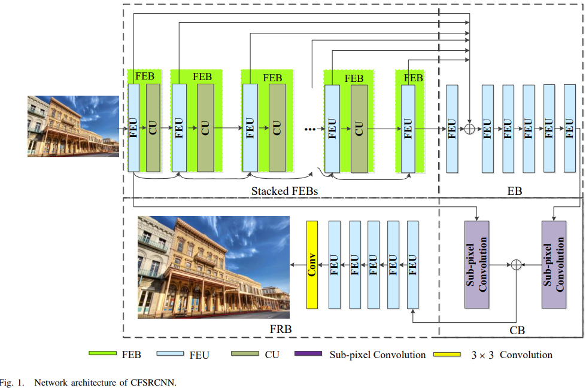

### 2. Architecture of the CFSRCNN.
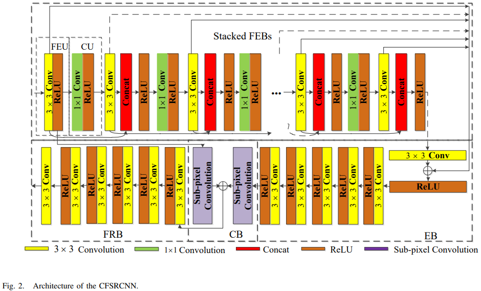

### 3. (a) The residual dense block (RDB) architecture proposed in [38]; (b) The FMM module in the CFSM [63].
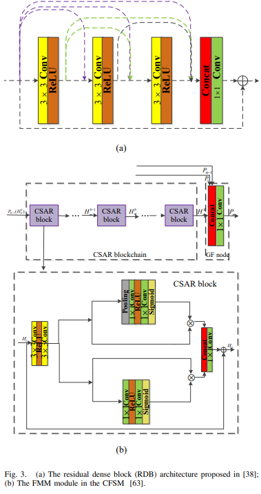

### 4. CFSRCNN for x2, x3 and x4 on Set5.
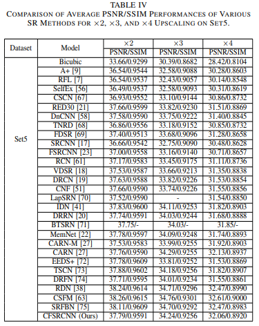

### 5. CFSRCNN for x2, x3 and x4 on Set14.
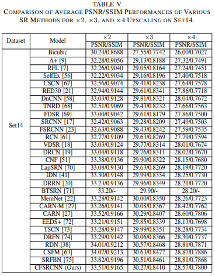

### 6. CFSRCNN for x2, x3 and x4 on B100.
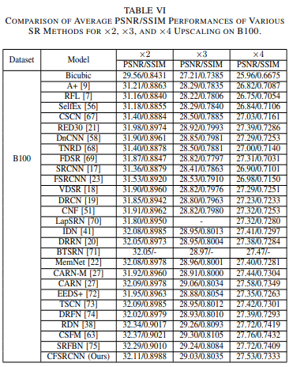

### 7. CFSRCNN for x2, x3 and x4 on U100.
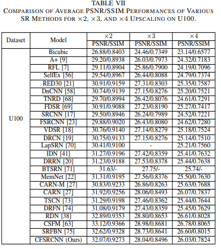

### 8. CFSRCNN for x2, x3 and x4 on 720p.
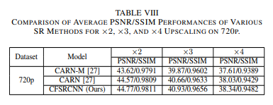

### 9. Running time of different methods on hr images of size 256x256, 512x512 and 1024x1024 for x2.
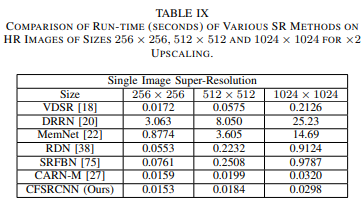

### 10. Complexities of different methods for x2.
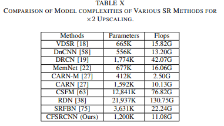

### 11. Visual results of Set14 for x2.

### 12. Visual results of B100 for x3.
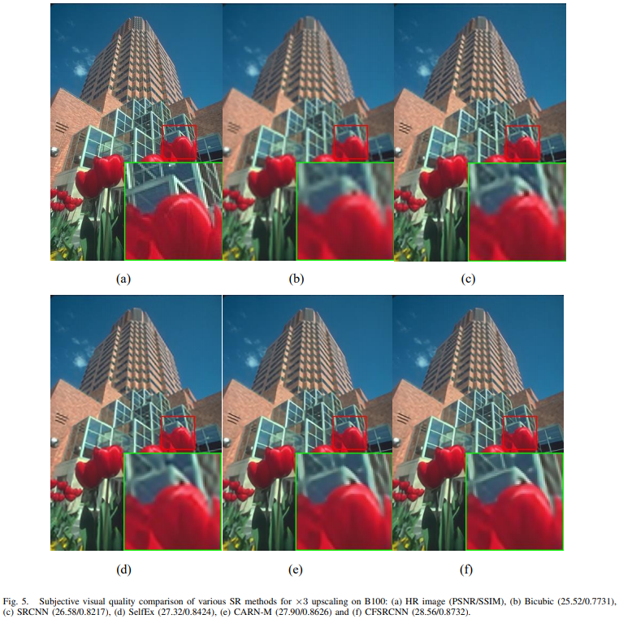

### 13. Visual results of U100 for x4.
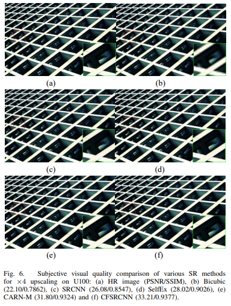

### If you want to cite this paper, please refer to the following formats:
#### 1. Tian C, Xu Y, Zuo W, et al. Coarse-to-fine CNN for image super-resolution[J]. IEEE Transactions on Multimedia, 2020.
#### 2. @article{tian2020coarse,
#### title={Coarse-to-fine CNN for image super-resolution},
#### author={Tian, Chunwei and Xu, Yong and Zuo, Wangmeng and Zhang, Bob and Fei, Lunke and Lin, Chia-Wen},
#### journal={IEEE Transactions on Multimedia},
####  year={2020},
####  publisher={IEEE}
####  }
